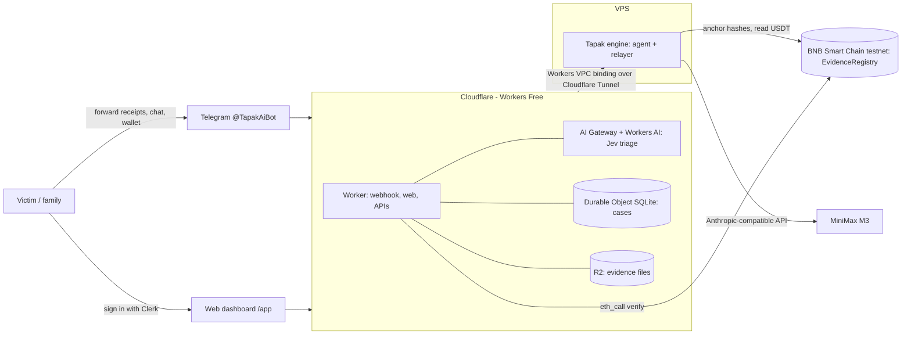

# Tapak — Cintanya palsu. Buktinya tetap utuh.

**Tapak AI** is an early-response copilot for victims of transfer scams (love scams, fake online sales, investment fraud) in Indonesia. In the first minutes after a victim realises they were scammed, Tapak:

1. tells them to call their bank's **fraud line first** and ask for a report number,
2. reads their **transfer receipts** (MiniMax M3 vision) and extracts the 7 data points that bank fraud teams and IASC ask for,
3. groups transfers into **one IASC report draft per destination account** (IASC requires one form per account) plus a **police chronology**,
4. reads the **WhatsApp chat export**, matches every money request to a proven transfer and flags **missing evidence**,
5. pulls **USDT transfers straight from BNB Smart Chain**, and
6. anchors the **SHA-256 fingerprint of every evidence file** in the `EvidenceRegistry` contract on BNB Chain, so anyone can later check that a file is byte-for-byte unchanged.

Tapak prepares **drafts**, never files reports on anyone's behalf, never promises recovered funds, and never puts personal data on-chain (only hashes).

Built for **Indonesia Web3 Hackathon 2026** · Tracks: **Finance & Commerce**, **AI Agents** · Chain: **BNB Smart Chain (testnet)**.

## Live

| | |
|---|---|
| Telegram bot | https://t.me/TapakAiBot |
| Web (dashboard, drafts, verifier) | https://tapak.bagusin.site (dashboard at `/app`, verifier at `/verify`) |
| Contracts (BSC testnet) | `EvidenceRegistry` and `DemoUSDT` — addresses in [`contracts/DEPLOYMENTS.md`](contracts/DEPLOYMENTS.md) |

## Architecture



- **Cloudflare Worker** (`worker/`): Telegram webhook (secret-token checked), public pages, Clerk-authenticated dashboard API, internal API for the engine. Free-text messages are triaged with **TypeSafe Jev (`typesafe/jev`) on Workers AI through Cloudflare AI Gateway** (gateway `default`, prompt logging off): typed questions return calibrated probabilities for intent (story / question / recovery-scam offer), paid-recovery-offer likelihood and urgency. Replies are templated, so the bot never promises recovered funds. State lives in a SQLite-backed **Durable Object** (available on the Workers Free plan); evidence files in **R2**. The Worker only does light work to stay within Free-plan CPU limits.
- **Engine** (`engine/`, runs on the VPS under systemd): the agent steps (receipt extraction, chat parsing, request↔transfer matching, draft writing via MiniMax M3), USDT log reads and the **relayer** that signs `anchor()` transactions. The relayer key never leaves the VPS. It is reachable only through a **Cloudflare Tunnel + Workers VPC service** — no public port.
- **Contracts** (`contracts/`, Foundry): `EvidenceRegistry` (anchor-once, never backdated; `verify(bytes32)` view) and `DemoUSDT` (worthless tUSDT used to simulate the scam's USDT transfers on testnet).

### What the chain proves — and what it doesn't
Proves: the checked file is identical to the file anchored at a given time; the record cannot be edited or deleted by anyone (including us); USDT transfers to the scammer's wallet. Does **not** prove: that chat content is true, the real identity of the scammer, or automatic admissibility in court.

## Repository layout

```
contracts/   Foundry project: EvidenceRegistry.sol, DemoUSDT.sol, tests, deploy script
engine/      Node 22 service for the VPS (AI agent + BSC relayer)
worker/      Cloudflare Worker (TypeScript): bot webhook, web, Durable Object store
demo/        Simulated demo data (receipts + WhatsApp export) — fictional
docs/        Concept document and pitch deck
```

## Running it

### Contracts
```bash
cd contracts
forge test
RELAYER_PRIVATE_KEY=0x... forge script script/Deploy.s.sol --rpc-url https://bsc-testnet-rpc.publicnode.com --broadcast
```

### Engine (VPS)
```bash
cd engine && npm install --omit=dev
cp .env.example .env   # fill in secrets
node src/server.js     # listens on 127.0.0.1:8790
```
Expose it to the Worker with a Cloudflare Tunnel (`cloudflared tunnel run` with the tunnel token) and a Workers VPC service:
`wrangler vpc service create tapak-engine --type http --tunnel-id <id> --ipv4 127.0.0.1 --http-port 8790`.

### Worker
```bash
cd worker && npm install
wrangler secret put TELEGRAM_TOKEN
wrangler secret put WEBHOOK_SECRET
wrangler secret put TAPAK_SECRET
wrangler secret put CLERK_SECRET_KEY
wrangler deploy
curl "https://api.telegram.org/bot<TOKEN>/setWebhook" -d url=https://<host>/telegram/webhook -d secret_token=<WEBHOOK_SECRET>
```

## Demo script
1. `/start` in @TapakAiBot → the first message is the urgent fraud-line step.
2. Send `demo/bukti-tf-1.png`, `-2.png`, `-3.png` → each receipt is read back (the cut-off reference number is flagged, not guessed).
3. Send `demo/WhatsApp Chat dengan Daniel.txt` and the demo victim wallet address.
4. `/laporan` → three IASC drafts (one per account), the Rp5 jt transfer from 2 June flagged as missing evidence, USDT transfers pulled from BSC, and a BscScan link for the anchor transaction.
5. Open `/verify`, drop a receipt → **Cocok ✓**; edit one byte → **Tidak cocok ✗**.

All demo data is fictional and labelled as a simulation.

## Team
Bagus Kurnianto · Al Fatih Abdurrahman Syah · Fian Febry Ispianto
